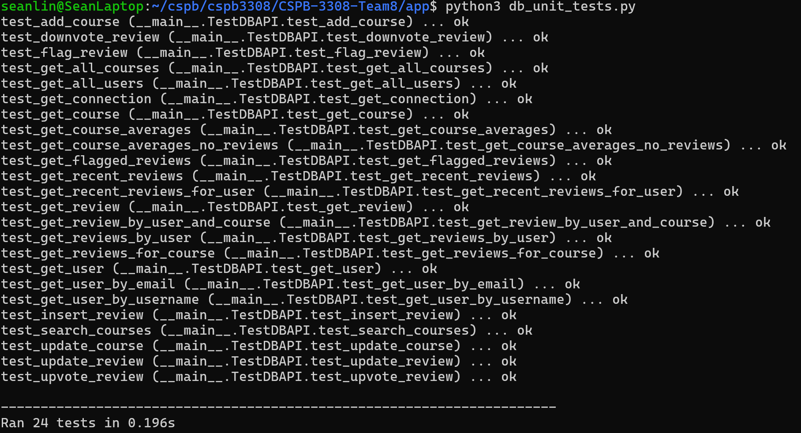
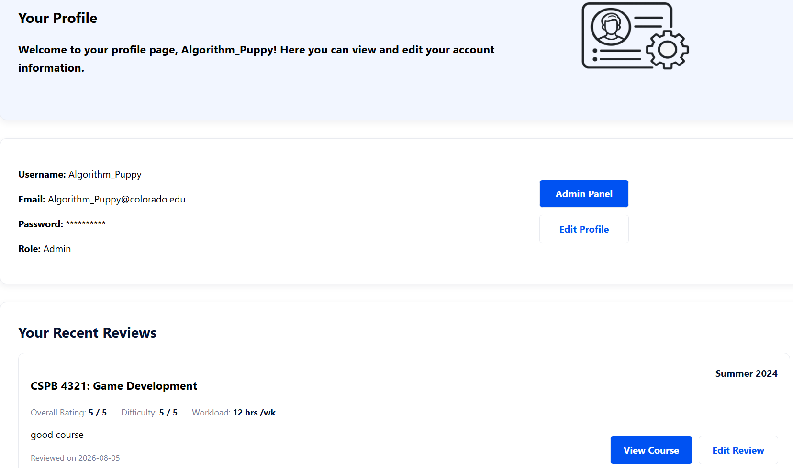
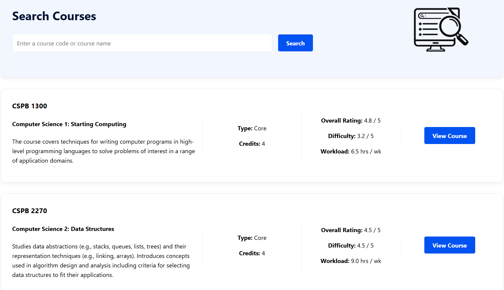
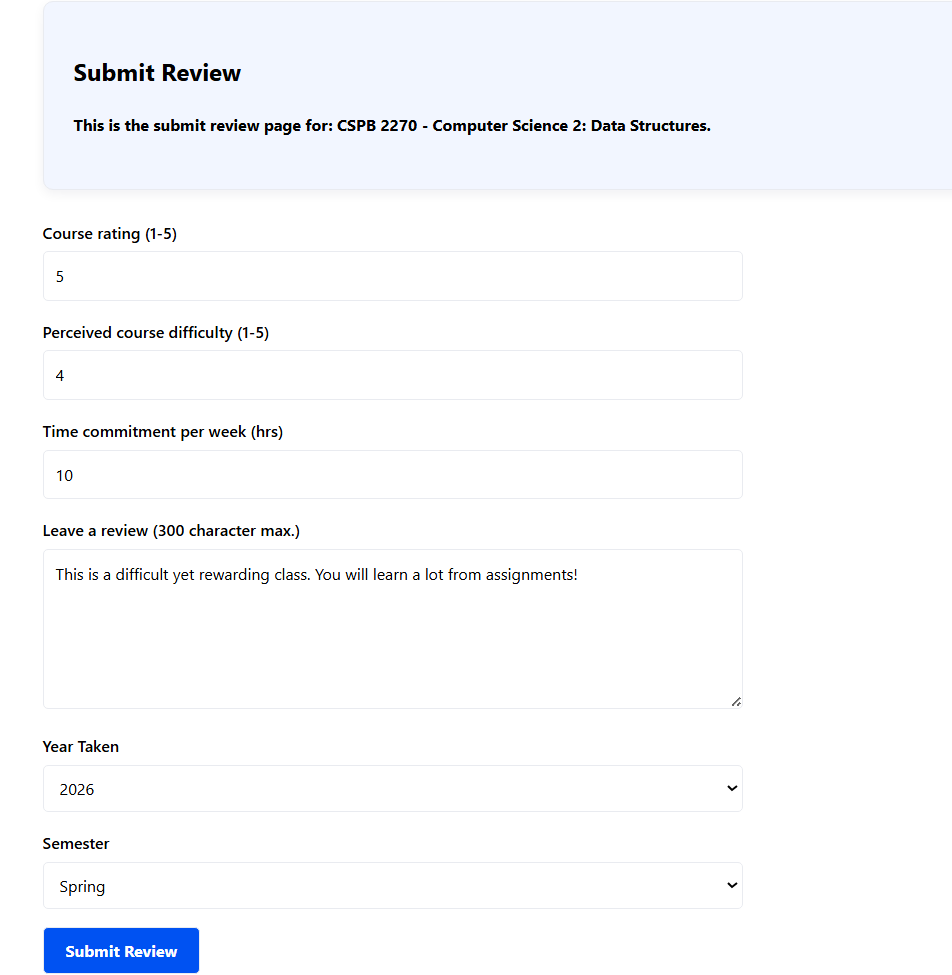
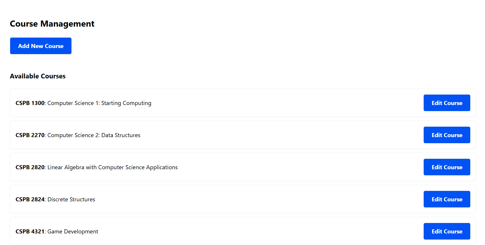
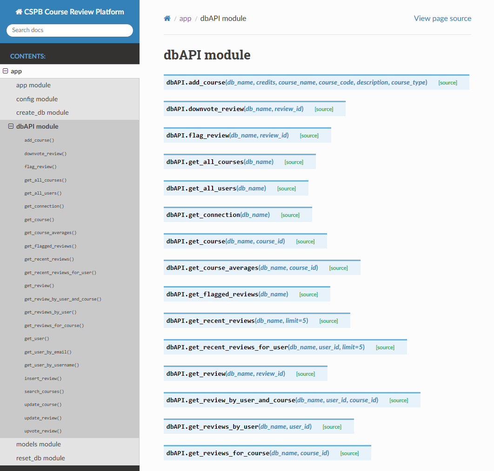
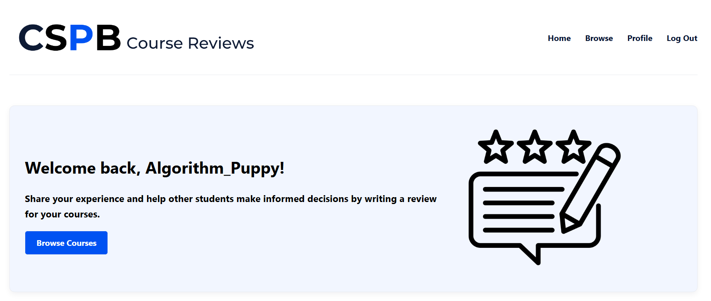

# CSPB Course Reviews Final Report (Milestone 8)

## Table of Contents
- [Our Project](#our-project)
- [Repository Readiness](#repository-readiness)
- [Final Status Report](#final-status-report)
- [System Overview](#system-overview)
- [Pages that Access Database Information](#pages-that-access-database-information)
- [Page Data Access Tests (High-Level)](#page-data-access-tests-high-level)
- [Reflection](#reflection)

## Our Project

### Project Title: CSPB Course Reviews

### Team Members
- Hannah Pfeifer
- Adam Chathankeo
- Sean Lin
- Craig Sanders

### Required Links

- **Google Doc** (Main document used for project tracking and planning): https://docs.google.com/document/d/1nF79oh0ICRbWhd5ra6tRL8jqTmVE5mIKCr6LFDHrqlA/edit?usp=sharing
- **Version control repository (GitHub)**: https://github.com/chant082/CSPB-3308-Team8
- **Project tracker** (no longer used): https://trello.com/w/userworkspace23812499
- **Demo video**: https://youtu.be/U64wILTFfX4

## Repository Readiness
All team members have verified that their latest work is pushed to the remote
repository.
The repository contains the following required files and assets:
- README.md
- WEEKLY_STATUS.md
- PAGE_TESTING.md
- SQL_TESTING.md
- FINAL_REPORT.md
- Project presentation files from the Presentation Milestone	
- Video of demo
- Source code (frontend and backend)
- Test cases (unit and integration)
- Source documentation and auto-generated documentation files

## Final Status Report

During the semester-long project in *CSPB 3308: Software Development Methods and Tools*, Team Infinity (Team 8) set out to create a web-based system for students enrolled in University of Colorado Boulder's Computer Science Post-Baccalaureate program. The goal of the project is to provide students with a centralized platform for sharing information about courses within the program. Through this website, students can view course information, share their experiences by writing reviews, and gain insight from other students while making planning decisions about their coursework.

### What We Completed
A working minimal viable product (MVP) that delivers essential features and functions including but not limited to:

- Flask user sessions and authentication for login/logout functionality
- Flask routes, CSS, and HTML to structure the website and render individual pages (Login, Sign Up, Courses, About, etc.)
- SQLite database and methods (dbAPI, create and reset database)
- README.md file with clear instructions on how to set up and use the app locally
- Project presentation slides and a customer-facing demo video
- Unit tests for database API methods

- Account Creation and Edit Profile

- Browse Courses, Look at Course Statistics, and Read reviews

- Write/edit one review per course (For User / Admin)

- Upvote / Downvote / Flag reviews (For User / Admin)

- Admin Panel (Admin only) allowing to create / edit courses, view other uses roles, and moderate flagged reviews

### What We Were in the Middle of Implementing
- Integration tests
- Auto-generated documentation files

### What We Planned for the Future

- **User profile/course images**: Upload and edit images

- **Username, email, and password**: Input data validation, retrieve forgotten password, automatic username generation, change username

- **Expand admin operations**: Ban users, give or remove admin privileges, delete flagged reviews, delete courses

- **More review features**: Leave comments on each review, delete one’s own review

- **Search filters for courses & reviews**: Set filters for advanced search and sorting courses and reviews

- **Better responsiveness for smaller screens**: Adapt to phone and tablet screen sizes

- **Increase database resilience**: Make the database more defensive against invalid user input, may consider migrating the database to postgres if needs arise

### Known Problems and Limitations

- **Unlimited upvotes and downvotes**: Currently no limit on upvoting/downvoting reviews; requires another db table to connect each user to one vote per review

- **The server crashes when a new user signs up with a duplicate username**: Username is defined as *Unique* in the Users table; we will need graceful front-end handling

- **Password**: Currently password is not hashed; we will need to implement more rigorous password handling

## System Overview
CSPB Review uses the following stack:

- **Frontend**: HTML/CSS

- **Backend**: Flask and Python

- **Database**: Currently sqlite (Future PostgreSQL)

The system was designed to support incremental development, clear separation of concerns, and straightforward testing.

## Pages That Access Database Information
- **Login/ Sign Up**: users
	- verify credentials or add a new user to database
- **Home**: courses, users, review 
	- personalized welcome message and navigation bar
	- recent review section
- **Admin Add/Edit Course**: courses
	- add or edit a course and its attributes to the database
- **Admin Panel**: courses, users, reviews 
	- admin panel manages all tables in database
- **Submit/Edit Review**: courses, users, reviews 
	- tie a user and their review to a specific course
- **Profile**: courses, users, reviews
	- profile info
	- recent review section
- **Update User Info**: users
	- update user’s password
- **Courses (Browse)**: courses, reviews
	- list all courses and average ratings
- **Course Details**: courses, users, reviews
	- list the course info and all reviews with the review author

## Page Data Access Tests (High-Level)

There are many access tests, but we will highlight 3 of the most important use cases below:

### Use case: Home page loads current data for the logged-in user

### Description
Verify the home page displays the logged-in username and the most recent reviews 

### Pre-conditions
- User account exists
- User is logged in
- The database has course reviews

### Test steps
1. Navigate to the Home page
2. Observe the Welcome message
3. Observe the list of reviews

### Expected result
- The welcome message shows the logged-in user’s username.
- The list of reviews displays the most recently written reviews, including course names, rating, difficulty, workload, review text, year & semester, upvote, downvote.

### Actual result
- Home page shows all the expected data

### Status
Pass

### Notes
N/A

### Post-conditions
No data is modified.

_______________________________________

### Use case: Submit a user-written course review to the platform

### Description
Verify that a user can submit a review, the review is inserted to the database, and the platform can retrieve this review

### Pre-conditions
- User account exists
- User is logged in
- The database exists
- The course exists

### Test steps
1. Navigate to the Submit Review page.
2. Write a review and submit.
3. Navigate to the Home page or the Course Details page of the reviewed course.

### Expected result
- The Submit Review page can take user input data.
- The Home Page or the Course Details page shows the review just submitted.

### Actual result
- The platform shows the review this user just submitted.

### Status
- Pass

### Notes
- N/A

### Post-conditions
- The user-written course review is inserted to the database.

________________________________________

### Use case: Add a new course to the platform

### Description
Verify that an administrator can add a course to the platform and users can write a review for the added course

### Pre-conditions
- Administrator account exists
- Administrator is logged in
- The database exists

### Test steps
1. Navigate to the Profile page.
2. Navigate to the Admin Panel page.
3. Navigate to the Add Course page.
4. Add a course and submit
5. Navigate the Browse page.
6. Write a review for the added course.

### Expected result
- An administrator can access the Add Course page and can add a new course to the platform. 
- The Browse page shows the newly added course.
- Users can write reviews for this course.

### Actual result
- An administrator can add a course. 
- The platform shows the new course.
- Users can write reviews for this course. 

### Status
- - Pass

### Notes
- N/A

### Post-conditions
- The new course is inserted to the database.

## Reflection
This project provided valuable hands-on experience with designing, building, testing, deploying, and presenting a full-stack web application. Throughout the project, our team learned not only technical skills but also the importance of communication, collaboration, planning, and adaptability.

### Key Takeaways

#### Scope Control and MVP
- Focusing on the Minimum Viable Product (MVP) helped keep the project manageable and ensured that we were able to deliver the core features before the project demo deadline.
- Prioritizing essential functionality prevented the team from becoming overwhelmed by additional features.

#### Technical Dependencies and Time Zones
- Many tasks depended on other components being completed first. For example, database and back-end functionality often needed to be completed before certain front-end features could be fully implemented.
- Waiting for pull requests to be reviewed and merged also occasionally affected development progress.
- Different time zones made coordination more challenging.
	- **Mitigation**: Weekly team meetings and frequent communication through Discord helped us coordinate dependencies and keep everyone updated.

#### Team Collaboration and Problem-Solving
- Although team members had different work styles, skill sets and experience levels, everyone was willing to help when someone encountered a difficult concept or technical problem.
	- **Mitigation**: We divided tasks based on individual strengths while helping one another when challenges arose.
- Clear task ownership, regular communication, and weekly check-ins helped maintain steady progress.
- Working together allowed us to troubleshoot problems more efficiently and learn from one another throughout the project.

#### Time Management
- Our actual development period was less than one month, which made the final weeks of the project especially intense.
- In retrospect, completing the design phase earlier and beginning implementation sooner would have provided more time for development, integration, and testing.

#### Deployment and Integration
- Each team member tested their assigned features locally before submitting and merging their changes. This helped us catch individual issues early, while integration testing helped ensure that features developed by different team members worked correctly together. 
- Deploying the application also taught us that something working locally does not always mean it will work the same way in a production environment. 
- Frequent testing and integration helped us identify problems earlier and reduced surprises near the end of the project.

#### Overall Learning Experience
- Despite initially being unfamiliar with some of the technologies and tools, we successfully implemented the project's core features.
- The project gave us practical experience with the complete software development lifecycle, including planning, design, implementation, version control, integration, testing, deployment, and presentation.
- Most importantly, we learned how to transform an initial idea into a functional and scalable software prototype.
