# 1) Course Browse Page (Guest & Logged-In)

## Page Title
CSPB Course Reviews

## Page Description
Purpose: Displays a list of CSPB courses with basic information including course names, credits, average ratings, average difficulty, average workload, course tags, and prerequisites (if implemented). Guests can browse all available courses without an account, while logged-in users can browse courses and access additional features.

**Mockup**

*Guest View:*

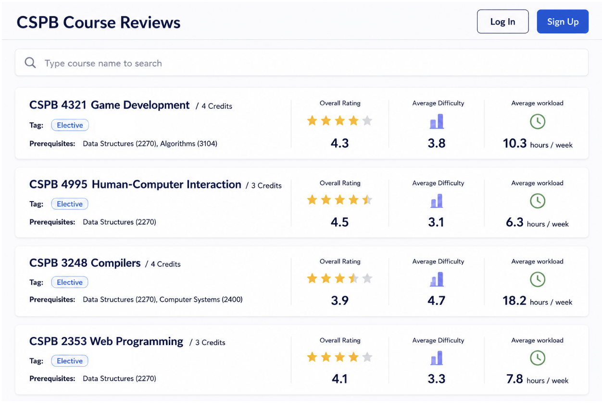

*Logged-In User View:*

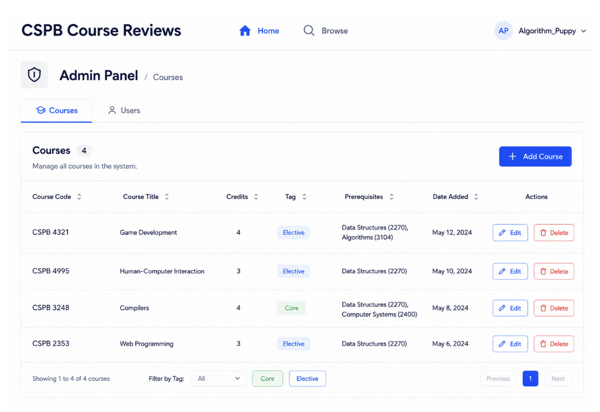

## Parameters Needed for the Page
- Route params: none
- Query params: none

## Data Needed to Render the Page
- Auth state:
  - User may be logged in or not logged in.
- API data:
  - Course names
  - Credits
  - Average ratings
  - Average difficulties
  - Average workloads
  - Core/Elective tags
  - Prerequisites (if implemented)
- UI state:
  - Loading state while course data is being retrieved

## Link Destinations for the Page
- Log In → Login page
- Sign Up → Create Account page
- Select Course → Course page

## Tests for Verifying Rendering of the Page

1. **Page title**
   - The page title appears correctly.

2. **Course list**
   - The list of available courses appears.

3. **Course information**
   - Course names appear.
   - Course credits appear.
   - Average ratings, difficulties, and workloads appear.
   - Course tags appear.
   - Course prerequisites appear (if implemented).

4. **Navigation**
   - Log In button navigates to the Login page.
   - Sign Up button navigates to the Create Account page.
   - Selecting a course navigates to the corresponding Course page.

---

# 2) Home Page (Regular User)

## Page Title
CSPB Course Reviews

## Page Description
Purpose: Displays the home page for a logged-in user. Users can browse courses, write reviews, view recently reviewed courses, and log out. Administrators also have access to the Admin Panel through the account menu.

**Mockup**

*Regular User View:*

*Admin View:*

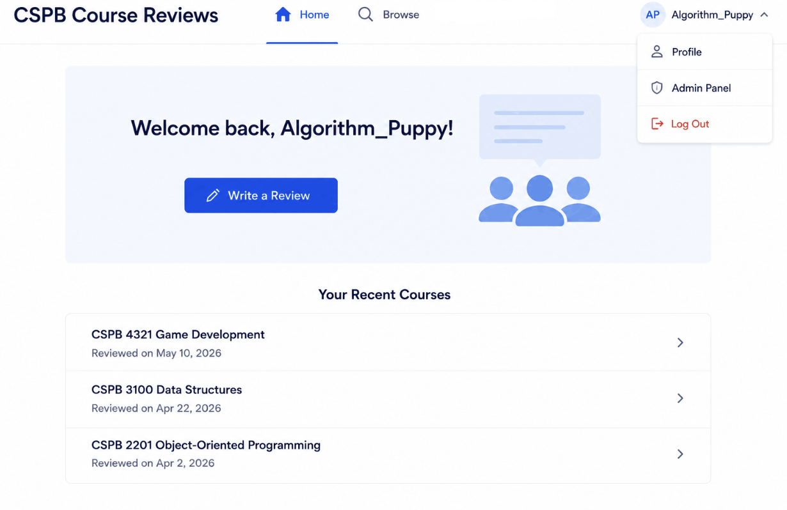

## Parameters Needed for the Page
- Route params: none
- Query params: none

## Data Needed to Render the Page
- Auth state:
  - User is logged in.
- API data:
  - Username
  - User role (regular user or admin)
  - Recently reviewed courses
- UI state:
  - Drop-down menu
  - Navigation buttons

## Link Destinations for the Page
- Write a Review → Review Writing page
- Browse → Course Browse page
- Log Out → Course Browse page (Guest View)
- Admin Panel → Admin Panel page (admin only)

## Tests for Verifying Rendering of the Page

1. **Page title**
   - The page title appears correctly.

2. **User information**
   - Username appears.
   - Recently reviewed courses are displayed.

3. **Navigation**
   - Home button appears.
   - Browse button appears.
   - Write a Review button appears.
   - Drop-down menu appears.
   - Log Out button appears.

4. **Admin functionality**
   - Admin Panel button appears for admin users.
   - Admin Panel button does not appear for regular users.

---

# 3) Login Page

## Page Title
Login

## Page Description
Purpose: Allows registered users to log into the application using their username and password.

**Mockup**

*Login Page:*

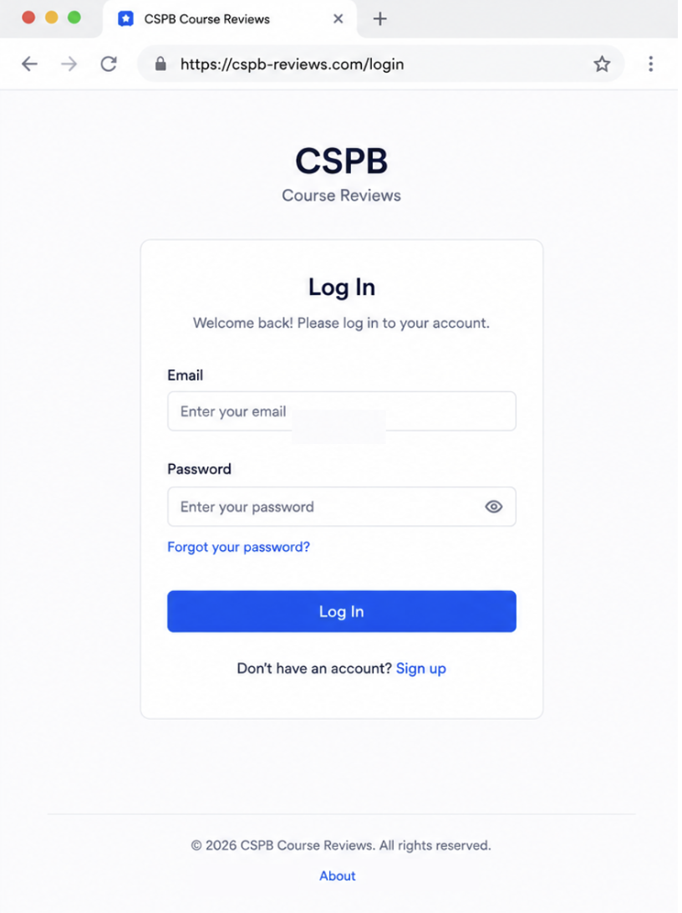

## Parameters Needed for the Page
- Route params:
  - `GET /login`
  - `POST /login`
- Query params:
  - Optional: `?next=/classes/<class for review>`

## Data Needed to Render the Page
- Auth state:
  - User is not logged in.
- API data:
  - User information used to verify credentials
  - Session created after successful login
- UI state:
  - Username field
  - Password field
  - Login button
  - Error message for invalid login attempts

## Link Destinations for the Page
- CSPB Course Reviews Logo → Home page (Guest View)
- Login → User Dashboard
- Sign Up → Create Account page
- Forgot Password → Reset Password page (optional)

## Tests for Verifying Rendering of the Page

1. **Form elements**
   - Login page loads successfully.
   - Username and password fields are displayed.
   - Navigation links appear correctly.

2. **Validation**
   - Submitting an empty form displays validation messages.

3. **Successful login**
   - Valid credentials create a session and redirect the user to the Dashboard.

4. **Failed login**
   - Invalid credentials display an error message and remain on the Login page.

5. **Authentication**
   - Users cannot access protected pages without logging in.

# 4a) Admin Panel (Courses)

## Page Title
Admin Panel

## Page Description
Purpose: Provides administrators with a panel to add, edit, and delete courses from the course catalog.

**Mockup**

## Parameters Needed for the Page
- Route params: none
- Query params: none

## Data Needed to Render the Page
- Auth state:
  - User is logged in.
- API data:
  - List of available courses
  - Course information for each course
- UI state:
  - User role: Admin
  - Username
  - Add, Edit, and Delete buttons

## Link Destinations for the Page
- Add Course → Add/Edit Course page
- Edit Course → Add/Edit Course page
- Delete Course → Displays confirmation dialog
- Browse → Course Browse page
- Log Out → Course Browse page (Guest View)
- Admin Panel → Admin Panel page

## Tests for Verifying Rendering of the Page

1. **Page elements**
   - The page title appears correctly.
   - The list of available courses appears.

2. **Course management**
   - Add Course button appears.
   - Edit Course button appears.
   - Delete Course button appears.

3. **User information**
   - Username appears.

4. **Navigation**
   - Home button appears.
   - Browse button appears.
   - Drop-down menu appears.
   - Log Out button appears.
   - Admin Panel button appears.

---

# 4b) Admin Panel (Users)

## Page Title
Admin Panel

## Page Description
Purpose: Provides administrators with a panel to view and manage user accounts.

**Mockup**

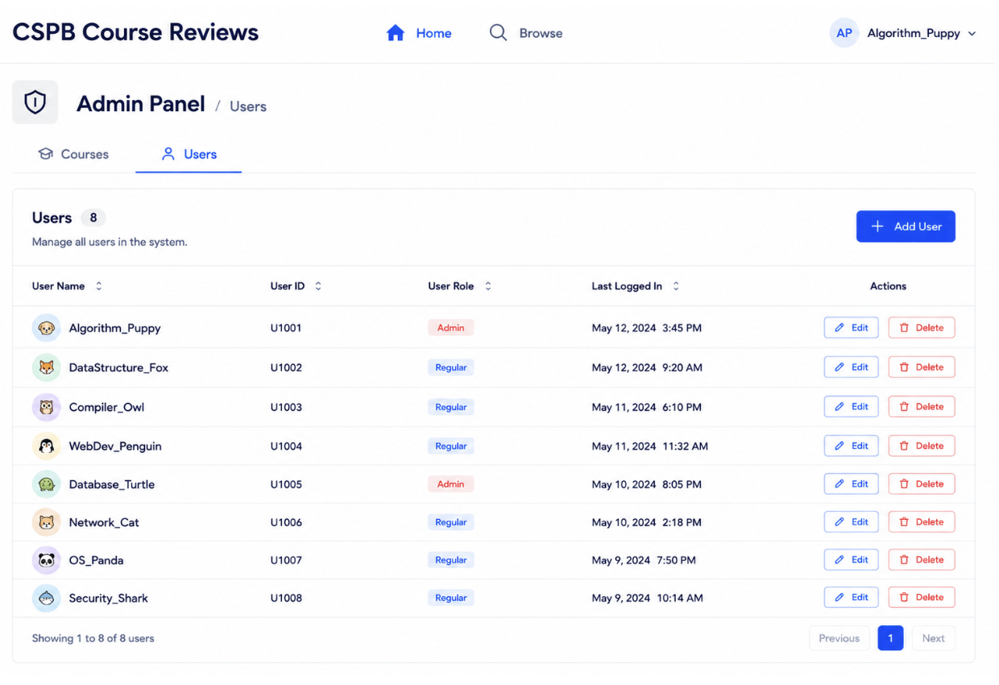

## Parameters Needed for the Page
- Route params: none
- Query params: none

## Data Needed to Render the Page
- Auth state:
  - User is logged in.
- API data:
  - List of registered users
  - User information for each account
- UI state:
  - User role: Admin
  - Username
  - User management controls

## Link Destinations for the Page
- Delete User → Displays confirmation dialog
- Browse → Course Browse page
- Log Out → Course Browse page (Guest View)
- Admin Panel → Admin Panel page

## Tests for Verifying Rendering of the Page

1. **Page elements**
   - The page title appears correctly.
   - The list of registered users appears.

2. **User information**
   - Username appears.
   - User ID appears.
   - User role appears.
   - Last login time appears.

3. **User management**
   - Add User button appears.
   - Edit User button appears.
   - Delete User button appears.

4. **Navigation**
   - Home button appears.
   - Browse button appears.
   - Drop-down menu appears.
   - Log Out button appears.
   - Admin Panel button appears.

---

# 5) Add/Edit Course

## Page Title
Add Course / Edit Course

## Page Description
Purpose: Allows an administrator to add a new course or edit an existing course.

**Mockup**

*Add New Course*

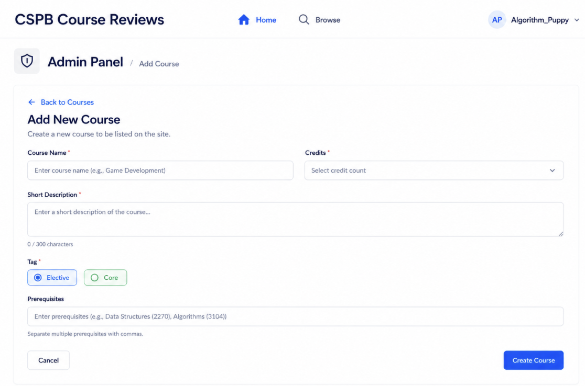

*Edit Course*

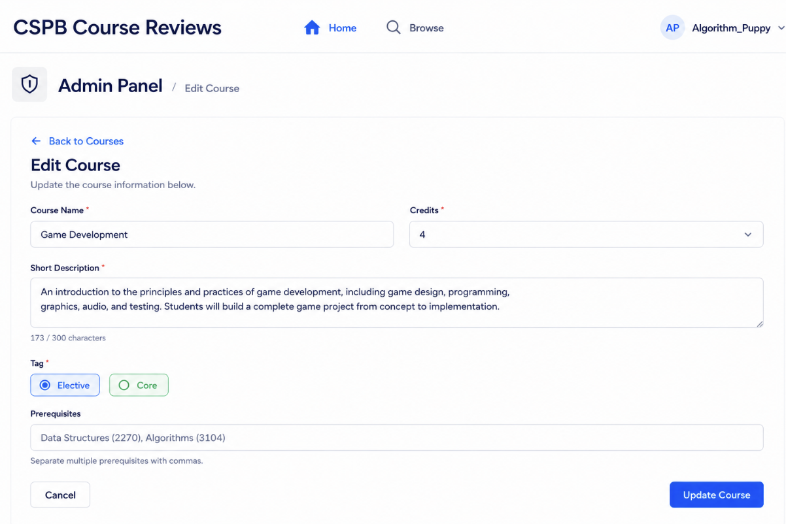

## Parameters Needed for the Page
- Route params: none
- Query params: none

## Data Needed to Render the Page
- Auth state:
  - User is logged in.
- API data:
  - Available courses
  - Selected course information (when editing)
- UI state:
  - User role: Admin
  - Username
  - Course Name field
  - Credits drop-down
  - Description field
  - Core/Elective selection
  - Add Course or Update Course button

## Link Destinations for the Page
- Add Course → Saves new course
- Update Course → Saves course changes
- Browse → Course Browse page
- Log Out → Course Browse page (Guest View)
- Admin Panel → Admin Panel page
- Cancel → Admin Panel page

## Tests for Verifying Rendering of the Page

1. **Page elements**
   - The page title appears correctly.
   - Course Name field appears.
   - Credits drop-down appears.
   - Description field appears.
   - Core/Elective radio buttons appear.

2. **Add course**
   - Empty fields are displayed when adding a new course.
   - Add Course button appears.

3. **Edit course**
   - Existing course information is displayed when editing.
   - Update Course button appears.

4. **Navigation**
   - Username appears.
   - Home button appears.
   - Browse button appears.
   - Drop-down menu appears.
   - Log Out button appears.
   - Admin Panel button appears.

---

# 6) Create Account

## Page Title
Create Account

## Page Description
Purpose: Allows a new user to create an account using their CU Boulder email address, a unique username, and a password.

**Mockup**

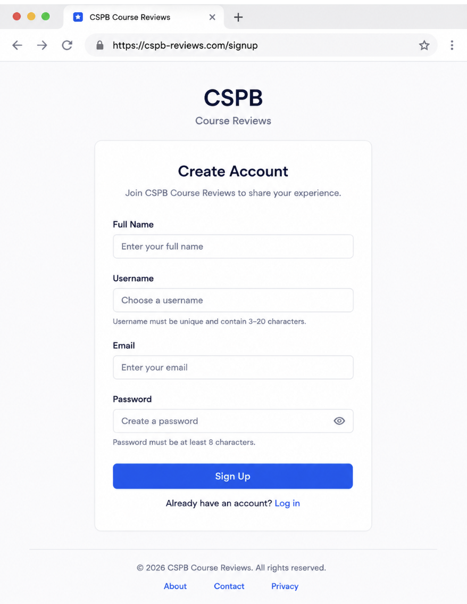

## Parameters Needed for the Page
- Route params: none
- Query params: none

## Data Needed to Render the Page
- Auth state:
  - User is not logged in.
- API data:
  - `POST /api/auth/register` → Create a new user account.
- UI state:
  - Full Name
  - Username
  - Email
  - Password
  - Form validation errors
  - Loading state while creating the account

## Link Destinations for the Page
- Sign Up → Creates the account and redirects to `/login`
- Log In → `/login`
- About → `/about`
- Contact → `/contact`
- Privacy → `/privacy`

## Tests for Verifying Rendering of the Page

1. **Form elements**
   - Full Name, Username, Email, Password fields, and Sign Up button are displayed.

2. **Required fields**
   - The form cannot be submitted if any required field is empty.

3. **Username validation**
   - Username must be unique and display an error if already taken.

4. **Email validation**
   - Only valid CU Boulder email addresses are accepted.

5. **Password validation**
   - Password must meet the minimum length requirement.

6. **Successful account creation**
   - A valid submission creates the account and redirects the user to the Login page (or Dashboard if automatic login is implemented).

7. **Duplicate account handling**
   - Attempting to register with an existing email or username displays an appropriate error message.

# 7) Review Account

## Page Title
Review Account

## Page Description
Purpose: Allows a logged-in user to review their account information and update their password.

**Mockup**

## Parameters Needed for the Page
- Route params: none
- Query params: none

## Data Needed to Render the Page
- Auth state:
  - User is logged in.
- API data:
  - `GET /api/user/profile` → Retrieve the user's account information.
  - `PUT /api/user/password` → Update the user's password.
- UI state:
  - Full Name
  - Username
  - Email
  - Member Since
  - Change Password button
  - Current Password
  - New Password
  - Confirm Password
  - Form validation errors
  - Loading state while updating the password

## Link Destinations for the Page
- Home → `/`
- Browse → `/browse`
- Change Password → Displays the password update form
- Save Password → Updates the user's password
- Cancel → Closes the password update form

## Tests for Verifying Rendering of the Page

1. **Account information**
   - Full Name, Username, Email, Member Since, and Change Password button are displayed.

2. **Password form**
   - Clicking Change Password displays the Current Password, New Password, and Confirm Password fields.

3. **Required fields**
   - The password form cannot be submitted if any required field is empty.

4. **Password validation**
   - New Password meets the minimum length requirement.
   - Confirm Password matches the New Password.

5. **Password update**
   - A valid submission updates the password and displays a success message.

6. **Error handling**
   - Entering an incorrect current password displays an appropriate error message.

7. **Loading state**
   - The Save Password button is disabled while the password update request is processing.

8. **Authentication**
   - Users who are not logged in are redirected to the Login page.

---

# 8) Course Page

## Page Title
*Course Title* (Displays the selected course title)

## Page Description
Purpose: Displays detailed information for a selected course, including average ratings, workload, difficulty, and student reviews. Logged-in users can write reviews, comment on reviews, and vote on review helpfulness.

**Mockup**

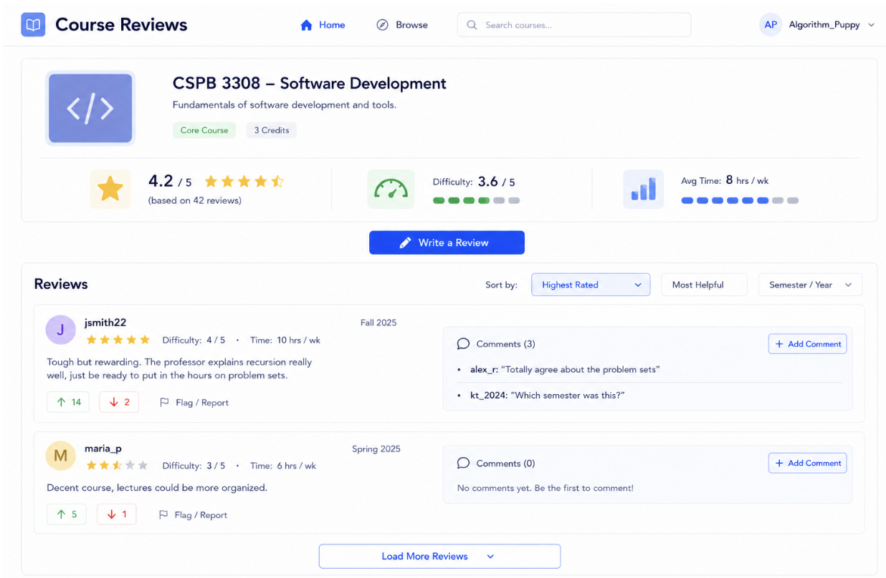

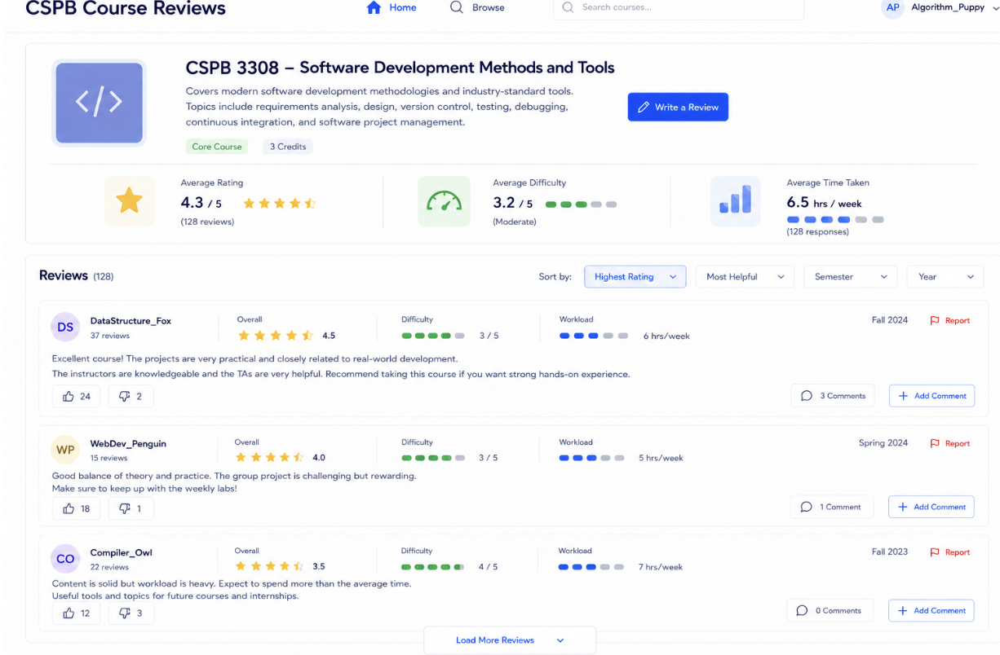

## Parameters Needed for the Page
- Route params:
  - `course_id`
- Query params: none

## Data Needed to Render the Page
- Auth state:
  - User may be logged in or browsing as a guest.
- API data:
  - Course number
  - Course title
  - Course description (if available)
  - Average rating
  - Average difficulty
  - Average workload
  - List of reviews
  - Reviewer usernames
  - Review ratings
  - Semester and year taken
  - Review text
  - Upvote/downvote counts
  - Review comments
- UI state:
  - Header navigation
  - Write Review button
  - Review filters (Highest Rating, Most Helpful, Semester, Year)
  - Add Comment button
  - Report button
  - User permissions for reviewing, commenting, and voting

## Link Destinations for the Page
- Home → `/dashboard/<user_id>` (logged in) or `/home` (guest)
- Browse Courses → `/browse`
- Search Courses → `/search`
- Write a Review → `/courses/<course_id>/review`
- Profile → `/profile/<user_id>` (logged-in users)

## Tests for Verifying Rendering of the Page

1. **Course information**
   - Course title is displayed.
   - Average rating, workload, and difficulty are displayed.

2. **Reviews**
   - Reviews are displayed for the selected course.
   - Each review displays the reviewer's username, rating, semester/year, and review text.

3. **Review interactions**
   - Upvote and downvote buttons appear and update vote counts correctly.
   - Comments are displayed correctly.
   - Logged-in users can add comments.

4. **Write Review**
   - Only logged-in, non-admin users can write a review.
   - The Write Review button opens the review submission page.

5. **Navigation**
   - Selecting a course from Browse or Search opens the correct Course page.
   - After submitting a review, the user is redirected back to the Course page.
   - After an admin creates a course, they are redirected to the new Course page.
   - Navigation links direct the user to the correct pages.

6. **Empty state**
   - If no reviews exist, the message **"No reviews yet. Be the first to review this course!"** is displayed.

---

## Notes for Implementation
- These pages are intended for use with a SQL database and a simple top navigation bar.
- Tests can be implemented using a manual UI checklist during development.

---

# 9) Review Writing Page

## Page Title
*Course Title* (Displays the selected course title)

## Page Description
Purpose: Allows a logged-in user to submit a course review by selecting the semester, year, difficulty, workload, overall rating, and entering review comments.

**Mockup**

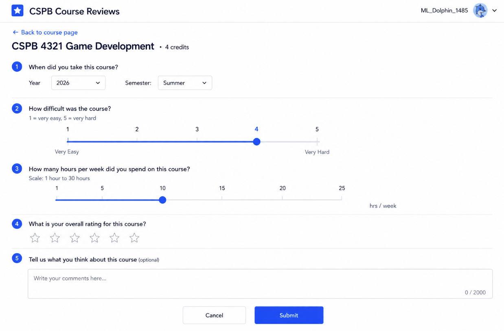

## Parameters Needed for the Page
- Route params:
  - `course_id`
- Query params: none

## Data Needed to Render the Page
- Auth state:
  - User is logged in.
- API data:
  - Course name
- UI state:
  - Username
  - Year selection
  - Semester selection
  - Difficulty rating
  - Hours per week
  - Overall rating
  - Comment text field
  - Submit button
  - Cancel button

## Link Destinations for the Page
- Submit → Saves the review and redirects to the Course page
- Cancel → Returns to the Course page
- Log Out → Course Browse page (Guest View)

## Tests for Verifying Rendering of the Page

1. **Page elements**
   - The page title appears correctly.
   - The course name appears.

2. **Review form**
   - Year selection appears.
   - Semester selection appears.
   - Difficulty selection appears.
   - Hours per week field appears.
   - Overall rating appears.
   - Comment text field appears.

3. **Form actions**
   - Submit button appears.
   - Cancel button appears.

4. **Submission**
   - A valid review submission saves the review and redirects to the Course page.
   - Required fields must be completed before submission.