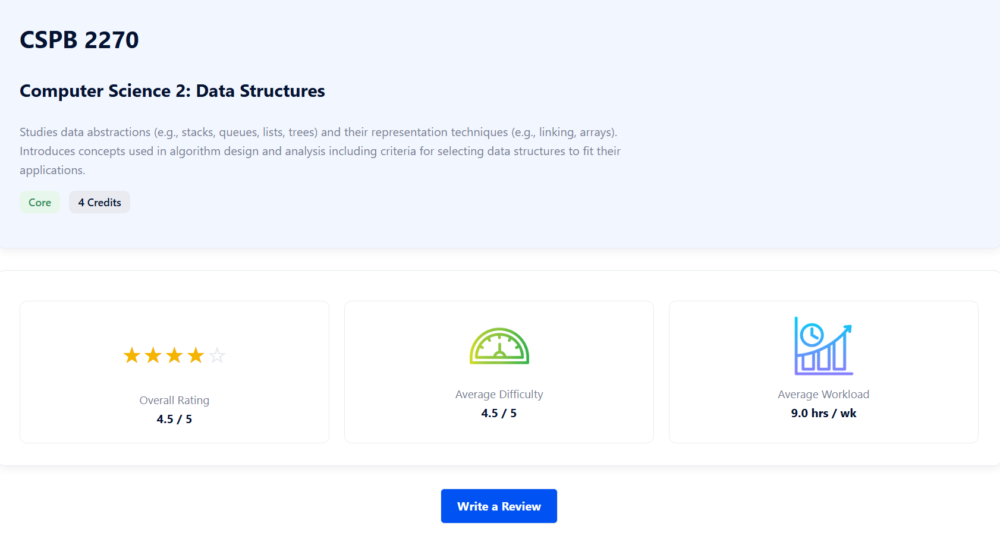
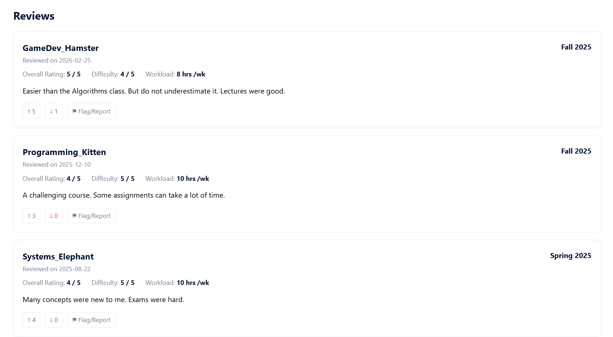

# Project: CSPB Course Review Platform

<div align="center">
  
</div>

## **Team Information**

**Team #**: 8

**Team/Product Name**: Team Infinity $\infty$

**Team members:**
- Adam Chanthakeo |
  chant082 |
  Adam.Chanthakeo@colorado.edu

- Hannah Pfeifer |
  hpfeifer37 |
  Hannah.Pfeifer@colorado.edu
  
- Craig Sanders |
  craig-dev-01 |
  Craig.Sanders@colorado.edu
  
- Ching-Hsiang (Sean) Lin |
  seanlinwriter |
  Ching-Hsiang.Lin@colorado.edu
  
#### Development method: Agile/Scrum


## Project Overview

### Vision statement 

CSPB Course Reviews is a website built to provide reviews for courses offered in the CSPB program at CU Boulder. After sign-up and log-in, students can browse and write reviews for the courses they have taken. 

To write a course review, students just need to fill out a questionnaire to provide essential information including course rating, difficulty, weekly workload, year and semester taken, and review text. 

Administrators can add and edit courses, manage accounts, and moderate reviews. Guests without accounts can still browse and view reviews but cannot contribute.

### Motivation

For years, CSPB students have had a hard time finding course reviews, which are often scattered and buried in various places, such as Discord, Reddit, Piazza, blogs, and private messages. We wanted to create a student-run platform where students can provide honest feedback about courses in the CSPB program. This will allow students to read course reviews from their peers and make more informed decisions when selecting classes.


## Tech Stack: Python, Flask, HTML/CSS, SQLite

We use a software architecture based on Flask. Users can interact with the application through a web browser by sending HTTP requests. The Flask application (app.py) defines routes for various pages, handles user requests, checks logic, and communicates with the SQLite database. 

The database stores the data in three main tables: Users, Courses, and Reviews. SQLite is easy to deploy and to maintain. Flask can retrieve and update data through database API methods and then render HTML pages using Jinja templates. We also use CSS files to provide a consistent visual design for all HTML pages. 

This architecture allows us to separate the application into several aspects: routing, data management, data presentation, and styling. It makes the project easier to develop, maintain, and expand.


## Setup

### Create a database

In the terminal, navigate to the *app* directory and run the Python script *create_db.py*

Depending on your python setup, you may need to use *python* or *python3*

```bash
$ python3 create_db.py
```

This creates SQL tables and populates the tables with initial test data. 

### Reset the database

To reset the database, run the Python script *reset_db.py* in the app directory.

```bash
$ python3 reset_db.py
```

This deletes the existing database and then re-creates a new database with initial test data.

Note that all the previously manually added data will disappear.

### Run the app

In the *app* directory, run the Python script *app.py*

```bash
$ python3 app.py
```

By default, a Flask application runs on http://127.0.0.1:5000

Copy and paste this URL into a web browser to run the app locally.

## Test Data

### Unit Tests

We have prepared a series of unit tests to verify the functionality of database APIs. 

Navigate to the *app* directory, run the Python script *db_unit_tests.py*

```bash
$ python3 db_unit_tests.py
```

<div align="left">
  
</div>


### Login Credentials


For testing purposes, the database is created with initial data.

To log in as an administrator or as a regular user, use the following credentials:

| Username        | Password | Role          |
|-----------------|----------|---------------|
| Algorithm_Puppy | ABCD1234 | Administrator |
| ML_Dolphin      | EFGH5678 | Regular User  |

Both a regular user and an administrator can write course reviews, but only an administrator can access advanced features for course/review management and moderation.


## Use the platform

### Basic Operations

<div align="left">
  
</div>


On most pages, you can access the following features on the top-right corner:

- Click **Home** to return to the Home page, where you can see the most recent reviews. A logged-in user sees a customized welcome message.

- Click **Sign Up** to create a new user account.

- Click **Log In** to log in with an existing account.

- Click **Browse** to see a list of currently available courses. You can search a course by either the course name (such as *Data Structures*) or by the course code (such as *CSPB 2270*).


<div align="left">
  
</div>


When browsing courses, click **View Course** to see the details of each course.


<div align="left">
  
</div>


When viewing a course, click **Write a Review** to review a course. This button will only appear for logged-in users.

Specify required information and submit your review. This review will appear on the page of this course. 

Click **Edit Review** to modify your existing review.


<div align="left">
  
</div>


You can also **Upvote**, **Downvote**, and **Report** a review from other users by clicking on the up arrow, down arrow, or flag button, respectively, below each review.


<div align="left">
  
</div>


On your **Profile** page, you can see the basic information of your account. You may change your password if needed. You can also see your own recent reviews.

<div align="left">
  
</div>

### Administrator operations

An administrator can see the **Admin Panel** on the **Profile** page.

This panel displays a list of available courses on the platform.

- Click **Add Course** and specify required information to add a new course to the platform. Users can then add reviews for this course.

- Click **Edit Course** for an existing course to modify course information.


<div align="left">
  
</div>


The panel also displays a list of registered user accounts and a list of flagged reviews.
